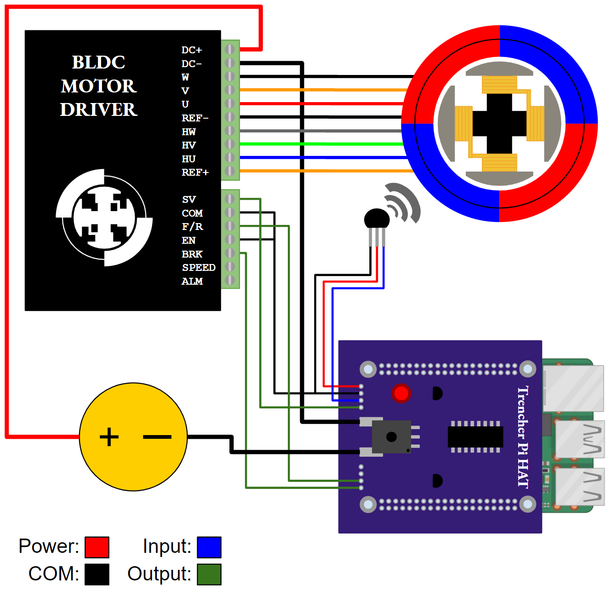

# Lunar Trencher Software Repository


<!-- PROJECT LOGO -->
<br />
<p align="center">
  <a href="Trencher-Electrical-System-Schematic.png>
    
  </a>
</p>


<!-- TABLE OF CONTENTS -->
<details open="open">
  <summary>Table of Contents</summary>
  <ol>
    <li>
      <a href="#about-the-project">About The Project</a>
    </li>
    <li>
      <a href="#running-the-trencher-software">Running the Trencher Software</a>
      <ul>
        <li><a href="#prerequisites">Prerequisites</a></li>
        <li><a href="#installation">Installation</a></li>
      </ul>
    </li>
    <li><a href="#usage">Usage</a></li>
    <li><a href="#controls">Controls</a></li>
  </ol>
</details>


<!-- ABOUT THE PROJECT -->
## About The Project

The PSTDL has an Augmented Sandbox project. This project uses a projector and a Fanuc robot with a trenching mechanism to map and collect data on excavating lunar simulant and the effects of layering. A previous senior capstone team, designed a bucket ladder trenching mechanism for this project. However, due to COVID, that senior design team was unable to complete the manufacturing, assembly and testing of their proposed trenching mechanism. In addition to manufacturing and assembling the previous design, testing this design will need to be conducted. From this testing our senior capstone group will be able to improve upon the design, optimize it and propose a new trenching design rated for vacuum conditions. Then our team will manufacture, build, assemble, and test this design. Further testing this design will prove the new trenching mechanism works better for the intended testing application. This vacuum rated version will be tested in the large Dusty Thermal Vacuum Chamber (DTVAC) of the PSTDL.

The need for this project is to help in the research and publication of what sort of excavation forces are experienced when digging regolith and frozen regolith. As well as the effects bucket ladder trenchers have on the distinct layers of regolith. This project will inform future design of lunar excavation systems.

![Schematic Pic][schematic]

<!-- RUNNING THE TRENCHER SOFTWARE -->
## Running the Trencher Software

This is a guide to installing the Trencher software on Ubuntu and Windows 10.

### Prerequisites

Install the latest version of Python 3 here: [https://www.python.org/downloads/](python3)

Install nmap here: [https://nmap.org/download.html](nmap)

### Installation

1. Clone the repo
   ```sh
   git clone https://github.com/Mining-Innovation-Enterprise/trencher.git
   ```
   Or alternatively download the .zip from the Code dropdown at the top of this page.
2. Install the pynput package with pip from a terminal:

   Ubuntu:
   ```sh
   pip3 install pynput
   ```
   Windows:
   Windows + R, type "cmd," press Enter will open a terminal
   ```sh
   py -m pip install pynput
   ```


<!-- USAGE EXAMPLES -->
## Usage

Connect to the Raspberry Pi either by direct ethernet to laptop (Ubuntu) or through a Router (Windows).

Find your IPv4 address of the ethernet connection through your laptop:

Windows: type "ipconfig" in the terminal and find IPv4 under Ethernet.

Linux: Go to Settings -> Network.

In the terminal, type
Ubuntu
```sh
nmap -sP xx.xx.xx.*
```
Windows:
```sh
Nmap -sP xx.xx.xx.*
```
where "xx" are the numbers of your IP address.

The IP that isn't your default gateway (Windows) or the IP of your computer is the pi.

With a router, you should be able to us "raspberrypi" in place of the IP.

SSH into the Pi:
```sh
ssh pi@xx.xx.xx.xx
```

Start the main program:
```sh
bash runtrencher.sh
```

Or navigate to the project directory and start it there:
```sh
cd  Trencher/trencher/Software\ Versions/RPi
python3 Main.py
```

Navigate to the project files stored on your computer on another terminal.

Start the client with the pi address as a parameter:

Ubuntu:
```sh
python3 Client.py xx.xx.xx.xx
```
Windows:
```sh
Python Client.py xx.xx.xx.xx
```
In both cases, make sure to check you are using Python 3:
```sh
Python --version
```

The Pi terminal will display "message received: hello" when a connection has been established.

<!-- CONTROLS -->
## Controls

### Up: Speed +1%

### Down: Speed -1%

### W:  Forward

### S:  Backward

### ESC:  Toggle Hard stop

### Space:  Reset speed to 0%

### DEL:  Terminate software


<!-- MARKDOWN LINKS & IMAGES -->
<!-- https://www.markdownguide.org/basic-syntax/#reference-style-links -->
[nmap]: https://nmap.org/download.html
[python3]: https://www.python.org/downloads/
[schematic]: Trencher-Electrical-System-Schematic.png
